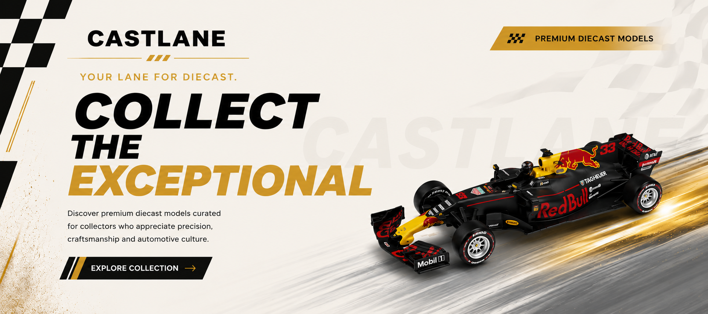
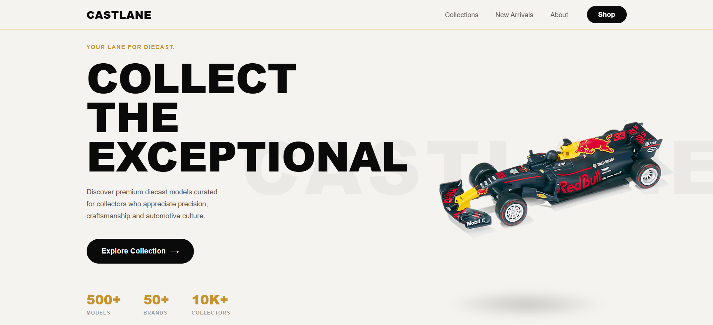

<p align="center">
  
</p>

<h1 align="center">CASTLANE</h1>

<p align="center">
  <strong>Your Lane for Diecast.</strong>
</p>

<p align="center">
  A premium destination for diecast collectors, enthusiasts, and automotive fans.
</p>

<p align="center">
  <a href="https://castlanes.vercel.app/">🌐 Live Website</a>
  &nbsp;&nbsp;•&nbsp;&nbsp;
  <a href="https://github.com/Adarshjain2001/castlane">📂 Source Code</a>
</p>

---

## About

CASTLANE is a modern diecast showcase platform built to celebrate the passion for miniature automotive collectibles. From iconic sports cars to legendary racing machines, CASTLANE provides a clean and immersive experience for exploring diecast collections.

---

## Preview

<p align="center">
  
</p>

---

## Highlights

🏎️ Premium automotive-inspired design

📱 Fully responsive across devices

🚘 Curated diecast collections

✨ Smooth and modern user experience

⚡ Fast performance powered by Vite

🎨 Clean and elegant visual presentation

---

## Tech Stack

* React.js
* Vite
* JavaScript
* CSS Modules
* Vercel

---

## Run Locally

Clone the project:

```bash
git clone https://github.com/Adarshjain2001/castlane.git
```

Go to the project directory:

```bash
cd castlane
```

Install dependencies:

```bash
npm install
```

Start the development server:

```bash
npm run dev
```

---

## Creator

**Adarsh Jain**

GitHub: https://github.com/Adarshjain2001

---

<p align="center">
Made with ❤️ for the Diecast Community
</p>
